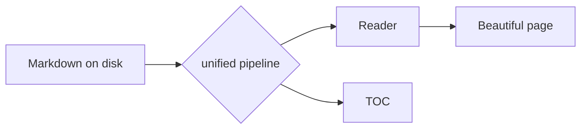

# The Folio torture test

This document exercises every rendering feature in PLAN.md §4. It is the permanent regression fixture — if this page renders correctly and beautifully, the pipeline is healthy. Check it after **any** pipeline or CSS change.

A paragraph with **bold**, *italic*, ~~strikethrough~~, `inline code`, a [standard relative link](./linked-note.md), a wikilink to [[linked note]], an aliased wikilink to [[linked note|the same note, aliased]], a broken wikilink to [[does not exist yet]], an autolink https://example.com, and a footnote.[^1]

[^1]: Footnotes render at the end of the document under a hairline rule.

## Tables

| Item | Category | Quantity | Unit price |
| --- | --- | ---: | ---: |
| Lora | Serif | 4 | 0.00 |
| Jost | Display | 5 | 0.00 |
| JetBrains Mono | Monospace | 2 | 0.00 |

Numeric columns are right-aligned in mono; rules are hairline only — top, header, bottom. No zebra striping.

## Task lists

- [x] Render GFM task lists
- [ ] Tick this checkbox — it should log the intended change (Phase 1) and write `[x]` back to this file (Phase 4)
- [ ] Nested content works too
  - [x] Including nested tasks

## Callouts

> [!NOTE]
> Callouts carry no colour. A mono label, a hairline border, a paper fill.

> [!TIP]
> Differentiation comes from the label, not from chroma.

> [!IMPORTANT]
> This one sits on the warmer `paper3` fill.

> [!WARNING]
> Warning and caution get full-strength ink borders for weight.

> [!CAUTION]
> Never drift toward coloured SaaS alert boxes.

## Blockquote

> Typography is the craft of endowing human language with a durable visual form.
> — Robert Bringhurst

## Code

```typescript
interface TreeNode {
  path: string;
  name: string;
  isDir: boolean;
  parent: string | null;
}

export function stems(nodes: TreeNode[]): Map<string, string> {
  const index = new Map<string, string>();
  for (const node of nodes.filter((n) => !n.isDir)) {
    index.set(node.name.replace(/\.md$/, "").toLowerCase(), node.path);
  }
  return index; // last-wins on duplicate stems; disambiguation is the UI's job
}
```

```rust
fn atomic_write(path: &Path, content: &str) -> std::io::Result<()> {
    let tmp = path.with_extension("md.folio-tmp");
    std::fs::write(&tmp, content)?;
    std::fs::rename(&tmp, path) // rename is atomic on APFS
}
```

```
A plain fence with no language still gets the mono treatment.
```

## Maths

Inline maths: the golden ratio is $\varphi = \frac{1 + \sqrt{5}}{2} \approx 1.618$.

Display maths:

$$
\int_{-\infty}^{\infty} e^{-x^2}\,dx = \sqrt{\pi}
$$

## Mermaid



## Images and rules

Horizontal rule below — short, centred, hairline.

---

### Deeper heading levels

#### Level four keeps the display face

Regular weight, slight letter-spacing, no rules below h2.

## A long paragraph for line-length checking

The reading column should hold at roughly seventy characters. Lora at sixteen pixels with a line-height around one-point-seven should feel like a well-set book page: comfortable, unhurried, with generous margins either side. If this paragraph feels cramped or the measure runs wide, the reading width token has regressed and must be fixed before anything else ships.

## Links (Phase 3 vault)

The rest of the sample vault (see [the vault index](./index.md)) exercises link routing and history beyond what this fixture alone covers: a cross-file anchor link to [the API spec's Endpoints section](./specs/api-spec.md#endpoints), a same-page anchor up to [the Mermaid diagram](#mermaid) (far enough up the page to prove the scroll actually moves), a wikilink to [[api spec]], and a deliberately ambiguous [[overview]] wikilink — `specs/overview.md` and `notes/overview.md` share that stem, so clicking it from here should offer a choice.
